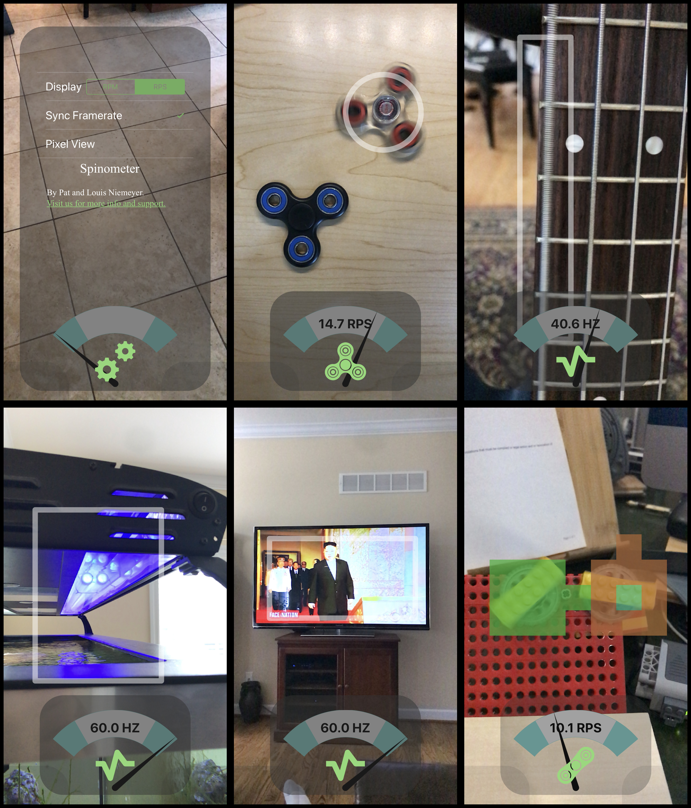
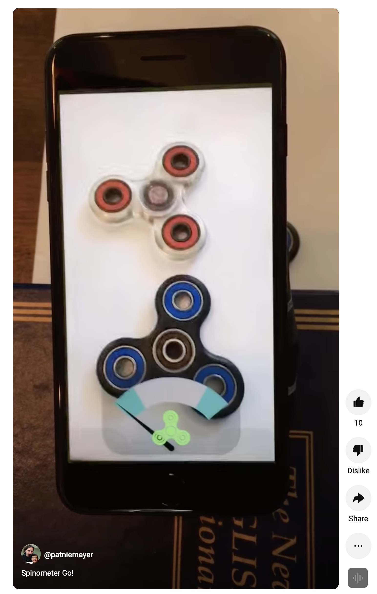

# Fidget Speedometer (Visual Frequency Meter) Archive

This is an archive of my 'Spinometer' iOS app, which was billed as a "speedometer" for fidget spinner toys, but 
more generally was a neat visual frequency meter. The code evaluates image blocks from live high-framerate video and, 
in real-time, performs an autocorrelation to estimate frequency of flickering or color change within the regions.  

It identifies a contiguous area of the screen with the highest overall frequency, annotates it, and displays the 
frequency in either Hz or RPM, depending on which mode is selected.  The app can also color the display to visualize the 
frequencies present across the entire screen.

Apologies for the messy code, this was a quick project.

## gallery

In the gallery you can see it identifying the 41Hz frequency of the E string on a bass guitar, and the 60Hz flicker
of a lamp and a tv.

## video

